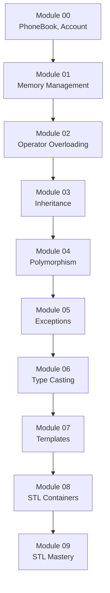

# Manual Completo de C++ - CPP 42

## 📚 Índice de Contenidos

1. [Introducción](#introducción)
2. [Fundamentos de C++](#fundamentos-de-c)
3. [Variables y Tipos de Datos](#variables-y-tipos-de-datos)
4. [Operadores](#operadores)
5. [Control de Flujo](#control-de-flujo)
6. [Funciones](#funciones)
7. [Arrays y Strings](#arrays-y-strings)
8. [Punteros y Referencias](#punteros-y-referencias)
9. [Programación Orientada a Objetos](#programación-orientada-a-objetos)
10. [Gestión de Memoria](#gestión-de-memoria)
11. [STL - Standard Template Library](#stl---standard-template-library)
12. [Entrada/Salida de Archivos (I/O)](#entradasalida-de-archivos-io)
13. [Algoritmos Avanzados](#algoritmos-avanzados)
14. [Conclusiones y Próximos Pasos](#conclusiones-y-próximos-pasos)

---

## STL - Standard Template Library (Continuación)

### Algoritmos STL

#### std::max_element y std::min_element

```cpp
std::vector<int>::iterator minIt = std::min_element(_myVector.begin(), _myVector.end());
std::vector<int>::iterator maxIt = std::max_element(_myVector.begin(), _myVector.end());
```

#### std::find

Usado en el ejercicio easyFind:

```cpp
template <typename T>
int easyFind(std::vector<T>& container, int value)
{
    typename std::vector<T>::iterator it = std::find(container.begin(), container.end(), value);
    if (it != container.end())
        return (std::distance(container.begin(), it));
    throw std::exception();
}
```

#### std::lower_bound

Usado en BitcoinExchange para búsqueda binaria eficiente:

```cpp
std::map<int, float>::iterator it = database.lower_bound(dateINT);
if (it != database.begin())
    --it;
``` [1](#2-0) 

### Iteradores

Los iteradores permiten recorrer contenedores de manera uniforme:

```cpp
// Iterador constante
std::vector<int>::const_iterator it;

// Iterador reverso
std::vector<int>::reverse_iterator rit;

// Uso en MutantStack
typename MutantStack<T>::iterator begin();
typename MutantStack<T>::iterator end();
``` [2](#2-1) 

---

## Entrada/Salida de Archivos (I/O)

### Streams de Archivos

#### std::ifstream (Lectura)

Usado en BitcoinExchange para leer el archivo CSV:

```cpp
std::ifstream dataFile("data.csv");
if (!dataFile.is_open())
    throw std::runtime_error("Error: could not open file.");

std::string line;
while (std::getline(dataFile, line))
{
    // Procesar cada línea
}
dataFile.close();
``` [3](#2-2) 

#### std::ofstream (Escritura)

Implementado en el ejercicio Files:

```cpp
class Files
{
private:
    std::ifstream inputFile;
    std::ofstream outputFile;
    
public:
    Files(const std::string& inFileName, const std::string& outFileName);
    std::ifstream& get_file_in();
    std::ofstream& get_file_out();
};
``` [4](#2-3) 

### Manejo de Errores en I/O

```cpp
if (!inputFile.is_open())
    print_error("Cannot open the input file.");

if (!outputFile.is_open())
{
    inputFile.close();
    print_error("Cannot open the output file.");
}
``` [5](#2-4) 

### Formato de Archivos

#### CSV Parsing

En BitcoinExchange se procesan archivos CSV:

```cpp
std::istringstream iss(line);
std::string dateStr;
std::string exchangeStr;

if (std::getline(iss, dateStr, ',') && std::getline(iss, exchangeStr))
{
    int dateINT = parse_date(dateStr, "Database");
    float exchange = parse_ammount(exchangeStr, "Database");
    database[dateINT] = exchange;
}
``` [6](#2-5) 

---

## Algoritmos Avanzados

### Algoritmos de Ordenamiento

#### Merge-Insertion Sort

Implementado en PmergeMe para comparar rendimiento:

```cpp
// Versión para std::vector
void vector_mergeInsertionSort(std::vector<int>& vector)
{
    if (vector.size() <= 1)
        return;
    
    // Algoritmo de merge-insertion sort
    // Dividir, ordenar subgrupos, luego fusionar
}

// Versión para std::list  
void lst_mergeInsertionSort(std::list<int>& list)
{
    // Implementación similar para listas
}
``` [7](#2-6) 

### Algoritmo RPN (Reverse Polish Notation)

```cpp
double rpn(std::string& input)
{
    std::stack<double> stack;
    std::istringstream iss(input);
    std::string token;
    
    while (iss >> token)
    {
        if (std::isdigit(token[0]))
        {
            stack.push(std::atof(token.c_str()));
        }
        else
        {
            // Operación matemática
            double b = stack.top(); stack.pop();
            double a = stack.top(); stack.pop();
            
            if (token == "+") stack.push(a + b);
            else if (token == "-") stack.push(a - b);
            else if (token == "*") stack.push(a * b);
            else if (token == "/") stack.push(a / b);
        }
    }
    return stack.top();
}
``` [8](#2-7) 

### Análisis de Complejidad

#### Comparación de Contenedores

PmergeMe demuestra diferencias de rendimiento:

```cpp
// Medir tiempo para vector
clock_t start = clock();
vector_mergeInsertionSort(vector);
clock_t end = clock();
double vector_time = double(end - start) / CLOCKS_PER_SEC;

// Medir tiempo para list
start = clock();
lst_mergeInsertionSort(list);
end = clock();
double list_time = double(end - start) / CLOCKS_PER_SEC;
```

### Algoritmos de Búsqueda

#### Búsqueda Binaria con std::map

```cpp
// Encontrar la fecha más cercana usando lower_bound
std::map<int, float>::iterator it = database.lower_bound(dateINT);

// Si no es exacta, usar el valor anterior
if (it != database.begin())
    --it;

float exchangeRate = it->second;
``` [1](#2-0) 

---

## Templates y Programación Genérica

### Templates de Clase

#### Array<T>

Implementación de un contenedor genérico:

```cpp
template <typename T>
class Array
{
private:
    T* _array;
    int _size;
    
public:
    Array(int size);
    Array(const Array& f);
    ~Array();
    
    T& operator[](int index);
    const T& operator[](int index) const;
    
    int size(void);
    void print(void);
};
``` [9](#2-8) 

### Templates de Función

```cpp
template <typename T>
void easyFind(std::vector<T>& container, int value);

template <typename T>
typename MutantStack<T>::iterator MutantStack<T>::begin()
{
    return (c.begin());
}
``` [10](#2-9) 

### Especialización de Templates

Los templates permiten escribir código que funciona con múltiples tipos:

```cpp
// Funciona con diferentes tipos
Array<int> numbers(10);
Array<std::string> words(4);

numbers[0] = 42;
words[0] = "Hola";
``` [11](#2-10) 

---

## Excepciones y Manejo de Errores

### Jerarquía de Excepciones

#### Excepciones Personalizadas

```cpp
class GradeTooHighException : public std::exception
{
public:
    virtual const char* what() const throw()
    {
        return "Grade is too high!";
    }
};

class GradeTooLowException : public std::exception
{
public:
    virtual const char* what() const throw()
    {
        return "Grade is too low!";
    }
};
```

### Try-Catch Blocks

```cpp
try
{
    // Código que puede lanzar excepción
    numbers[-2] = 0;  // Índice inválido
}
catch(const std::exception& e)
{
    std::cerr << e.what() << '\n';
}
``` [12](#2-11) 

### Validación de Entrada

```cpp
try
{
    dateINT = parse_date(dateStr, "Database");
    exchange = parse_ammount(exchangeStr, "Database");
}
catch(const std::exception& e)
{
    std::cerr << e.what() << '\n';
    continue;
}
``` [13](#2-12) 

---

## Type Casting

### static_cast

```cpp
// Conversión segura entre tipos relacionados
float value = 42.42f;
int intValue = static_cast<int>(value);
```

### dynamic_cast

```cpp
// Para polimorfismo en tiempo de ejecución
Base* base = generate();
Derived* derived = dynamic_cast<Derived*>(base);
if (derived)
{
    // Usar métodos de Derived
}
``` [14](#2-13) 

### reinterpret_cast

```cpp
// Para conversión entre tipos no relacionados
// Uso avanzado, generalmente evitado
```

### const_cast

```cpp
// Para añadir o quitar const
const int* constPtr = &value;
int* mutablePtr = const_cast<int*>(constPtr);
```

---

## Conclusiones y Próximos Pasos

### Resumen del Aprendizaje

Este manual te ha guiado a través de los conceptos fundamentales de C++ necesarios para resolver todos los ejercicios del repositorio CPP_Piscine:

1. **Fundamentos**: Estructura básica, compilación con Makefiles
2. **Programación Orientada a Objetos**: Clases, herencia, polimorfismo
3. **Gestión de Memoria**: new/delete, deep copy, Rule of Three
4. **STL**: Contenedores, algoritmos, iteradores
5. **Templates**: Programación genérica
6. **I/O**: Manejo de archivos y streams
7. **Algoritmos Avanzados**: Ordenamiento, búsqueda, análisis de complejidad

### Progresión Recomendada



### Buenas Prácticas Implementadas

1. **C++98 Compliance**: Todo el código sigue el estándar C++98
2. **Memory Management**: Uso correcto de new/delete, RAII
3. **Error Handling**: Excepciones y validación robusta
4. **Code Organization**: Separación .hpp/.cpp, Makefiles consistentes
5. **OOP Principles**: Encapsulación, herencia, polimorfismo

### Próximos Pasos

Después de completar todos los módulos:

1. **Práctica Adicional**: Implementa tus propios contenedores STL
2. **C++ Moderno**: Explora C++11/14/17/20 features
3. **Proyectos Personales**: Aplica estos conceptos en proyectos propios
4. **Optimización**: Estudia algoritmos y estructuras de datos más avanzadas

### Recursos Adicionales

- **cppreference.com**: Referencia completa de C++
- **Stack Overflow**: Resolución de problemas específicos
- **GitHub**: Explora otros proyectos C++ para aprender más patrones

---

## Notas

Este manual está basado exclusivamente en los ejercicios del repositorio CPP_Piscine. Cada concepto está directamente relacionado con implementaciones reales encontradas en los módulos. Para obtener el máximo beneficio, estudia cada concepto junto con su implementación correspondiente en el código fuente.

Los ejercicios están diseñados para construirse progresivamente, por lo que es fundamental dominar cada módulo antes de continuar con el siguiente. La práctica constante y la experimentación con el código son clave para el aprendizaje efectivo de C++.

Wiki pages you might want to explore:
- [Overview (PepeSegura/CPP_Piscine)](/wiki/PepeSegura/CPP_Piscine#1)
- [Module 00: C++ Foundations (PepeSegura/CPP_Piscine)](/wiki/PepeSegura/CPP_Piscine#3)

### Citations

**File:** CPP_Module_08/ex02/inc/MutantStack.tpp (L15-25)
```text
template <typename T>
typename MutantStack<T>::iterator MutantStack<T>::begin()
{
    return (c.begin()); 
}

template <typename T>
typename MutantStack<T>::iterator MutantStack<T>::end()
{
    return (c.end()); 
}
```

**File:** CPP_Module_09/ex00/srcs/BitcoinExchange.cpp (L91-116)
```cpp
	while (std::getline(dataFile, line))
	{
		std::istringstream	iss(line);
		std::string			dateStr;
		std::string			exchangeStr;

		if (std::getline(iss, dateStr, ',')  && std::getline(iss, exchangeStr))
		{
			int		dateINT;
			float	exchange;
			try
			{
				dateINT	 = parse_date(dateStr, "Database");
				exchange = parse_ammount(exchangeStr, "Database");
			}
			catch(const std::exception& e)
			{
				std::cerr << e.what() << '\n';
				continue ;
			}	
			database[dateINT] = exchange;
		}
		else
			std::cerr << "Database: bad input: " << line << std::endl;
	}
	dataFile.close();
```

**File:** CPP_Module_01/ex04/srcs/Files.cpp (L15-27)
```cpp
Files:: Files(const std:: string& inFileName, const std:: string& outFileName)
    : inputFile(inFileName.c_str()), outputFile()
{
    if (!inputFile.is_open())
		print_error("Cannot open the input file.");

    outputFile.open(outFileName.c_str());
    if (!outputFile.is_open())
    {
        inputFile.close();
		print_error("Cannot open the output file.");
    }
}
```

**File:** CPP_Module_09/ex01/inc/RPN.hpp (L13-18)
```text
#include <stack>
#include <iostream>
#include <sstream>
#include <cstdlib>

double	rpn(std::string& input);
```

**File:** CPP_Module_07/ex02/inc/Array.hpp (L17-35)
```text
template <typename T>
class Array
{
	public:
		Array(int size);
		Array(const Array& f);
		~Array();
		Array& 		operator=(const Array& f);

		int			size(void);
		void		print(void);

		const T&	operator[](int index) const;
		T&			operator[](int index);

	private:
		T	*_array;
		int	_size;
};
```

**File:** CPP_Module_07/ex02/srcs/main.cpp (L22-43)
```cpp
    Array<int>	numbers(MAX_VAL);
    int*		mirror = new int[MAX_VAL];

    srand(time(NULL));
    for (int i = 0; i < MAX_VAL; i++)
    {
        const int	value = rand();

        numbers[i] = value;
        mirror[i]  = value;
    }

	numbers.print();

	Array<std::string> words(4);

	words[0] = "Hola";
	words[1] = "me";
	words[2] = "llamo";
	words[3] = "Pepe";

	words.print();
```

**File:** CPP_Module_07/ex02/srcs/main.cpp (L59-66)
```cpp
    try
    {
        numbers[-2] = 0;
    }
    catch(const std::exception& e)
    {
        std::cerr << e.what() << '\n';
    }
```

**File:** CPP_Module_06/ex02/srcs/main.cpp (L97-110)
```cpp
	Base *test[TEST_SIZE];

	for (int i = 0; i < TEST_SIZE; i++)
		test[i] = generate();

	std::cout << "ID\t|  Identify(PTR)\t|  Identyfy(REF)" << std::endl;
	std::cout << "------------------------------------------------" << std::endl;
	for (int i = 0; i < TEST_SIZE; i++)
	{
		std::cout << "[" << i << "]\t|  ";
		identify(test[i]);
		std::cout << "\t|  ";
		identify(*test[i]);
	}
```
